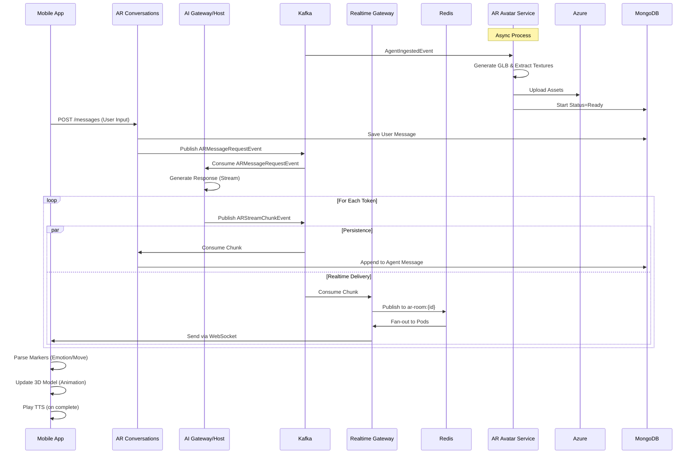

# Gravity AR & 3D Architecture Review

## Overview
This document outlines the architecture and data flow for the Augmented Reality (AR) and 3D avatar components of the AI Chat Distributed system.

## Key Services

### 1. AR Avatar Service (`backEnd/ar-avatar`)
Responsible for generating and managing 3D avatars for agents.
- **Trigger**: Listens for `AgentIngestedEvent` (Kafka).
- **Core Logic**:
    - **Generation**: Uses `model-generator` to create a 3D model (GLB) based on the agent's profile.
    - **Optimization**: Extracts textures from the GLB file to ensure compatibility with React Native (which has issues with embedded textures in GLBs).
    - **Storage**: Uploads the processed GLB, `.bin`, and extracted textures to Azure Blob Storage.
    - **Persistence**: Stores avatar metadata and status in MongoDB.

### 2. AR Conversations Service (`backEnd/ar-conversations`)
Manages the chat session state for AR experiences.
- **Entry Point**: REST API for sending messages (`POST /api/ar-rooms/:roomId/messages`).
- **Processing**:
    - Saves the user's message to MongoDB with status `streaming`.
    - Publishes `ARMessageRequestEvent` to Kafka to trigger AI processing.
- **Consumption**: Listens for `ARStreamChunkEvent` to update the agent's response in the database for persistence (eventual consistency).

### 3. AI Gateway & AI Chat Host
The brain of the conversation.
- **Trigger**: Listens for `ARMessageRequestEvent`.
- **Processing**: Forwards the request to the AI model.
- **Output**: Streams the response back as tokens.
- **Publication**: Publishes `ARStreamChunkEvent` to Kafka for each chunk of generated text (including markers for emotions/movements).

### 4. Realtime Gateway (`backEnd/realtime-gateway`)
Handles low-latency delivery of AI responses to the client.
- **Listener**: Consumes `ARStreamChunkEvent` from Kafka.
- **Fan-out**: Publishes the chunk to a Redis channel `ar-room:{roomId}`.
- **WebSocket**: All Gateway pods subscribed to the Redis channel forward the chunk to connected WebSocket clients in that room.

## Client-Side Implementation (`client/mobile-app`)

### AR Chat Screen (`app/(main)/ARChatScreen.tsx`)
- **Connection**: joins the room via WebSocket with `{ isARRoom: true }`.
- **State Management**: Maintains `messages` and `streamingContent` state.
- **Real-time Updates**: Appends incoming `ar-stream-chunk` data to the current message.
- **Marker Parsing**: Real-time parsing of "markers" in the text (e.g., `<emotion:happy>`, `<move:wave>`).
- **TTS**: Triggers Text-to-Speech (via `expo-speech`) when the final chunk is received.

### 3D/AR Rendering
- **Components**: `ARViewer` and `Model3DViewer`.
- **Rendering**: Uses `expo-gl` and `three.js` (via `expo-three`) to render the GLB model.
- **Textures**: Loads external textures provided by `ar-avatar-service` (bypassing React Native's GLB embedded texture limitation).
- **Animation**: Applies animations based on parsed markers (e.g., triggering a "wave" animation when `<move:wave>` is received).

## Data Flow Diagram

